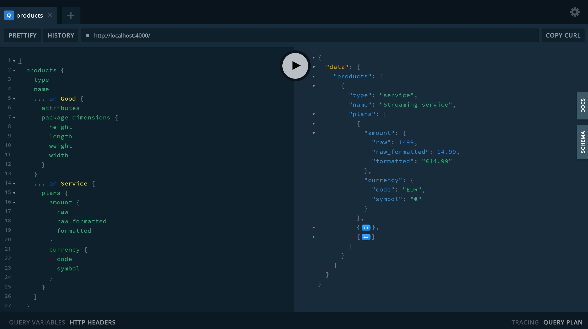

# stripe-graphql

[]()
[]()

> ⚠️ Warning! This is a very early version. You SHOULD NOT use this in production yet.

## What is `stripe-graphql`?

`stripe-graphql` is a GraphQL API for Stripe with a lot of benefits. Its goal is to help you do things better and faster related to the Stripe world while providing you with the best developer experience (DX).

It ships with a type-safe GraphQL client, and exposes the GraphQL schema object so that you can create your own Stripe GraphQL API, transform the schema or do whatever you need.

## Features

- ✅ Simple and powerful
- ✅ Formatted amounts ready to use
- ✅ Type-safe GraphQL-based client
- ✅ Expose the GraphQL schema object

## TODO

- [ ] DataLoader support for batching and caching
- [ ] Nexus extension/plugin for more easy integration

## Get started

`npm install stripe-graphql` or `yarn add stripe-graphql`.

## Client

### Request

```ts
import { client } from "stripe-graphql";

try {
  const data = await client.query({
    plans: {
      nickname: true,
      active: true,
      amount: { raw: true, raw_formatted: true, formatted: true },
      currency: { code: true, symbol: true },
    },
  });
  console.log(JSON.stringify(data, null, 2));
} catch (error) {
  console.log(error);
}
```

### Response

```json
{
  "plans": [
    {
      "nickname": "premium-monthly-plan-in-eur",
      "active": true,
      "amount": {
        "raw": 1499,
        "raw_formatted": 14.99,
        "formatted": "€14.99"
      },
      "currency": {
        "code": "EUR",
        "symbol": "€"
      }
    },
    {
      "nickname": "standard-monthly-plan-in-eur",
      "active": true,
      "amount": {
        "raw": 999,
        "raw_formatted": 9.99,
        "formatted": "€9.99"
      },
      "currency": {
        "code": "EUR",
        "symbol": "€"
      }
    },
    {
      "nickname": "basis-monthly-plan-in-eur",
      "active": true,
      "amount": {
        "raw": 499,
        "raw_formatted": 4.99,
        "formatted": "€4.99"
      },
      "currency": {
        "code": "EUR",
        "symbol": "€"
      }
    }
  ]
}
```

## Schema

```ts
import { schema } from "stripe-graphql";

// Do whatever you need with the schema
```

## Contributing

Do you know how to improve it? Feel free to contribute to this project.

1. Install dependencies: `npm install` or `yarn install`
2. Run the development server: `npm run dev` or `yarn dev`

The server should start. You're ready to help. 🙏

## License

MIT.
