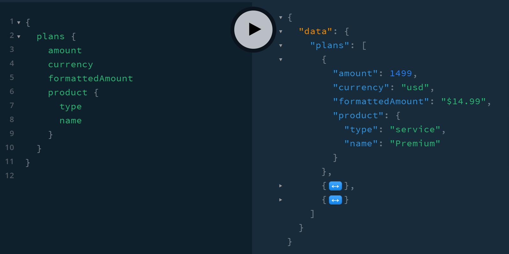

# stripe-graphql

[]()
[]()

> ⚠️ Warning! This is a very early version. You SHOULD NOT use this in production yet.

## What is `stripe-graphql`?

`stripe-graphql` is a GraphQL API for Stripe with a lot of benefits. Its goal is to help you do things better and faster related to the Stripe world while providing you with the best developer experience (DX).

## Features

- GraphQL API (connected resources for easier integration)
- Easy to understand/use
- Formatted amounts ready to use
- DataLoader support for batching and caching
- Type-safe bindings with TypeScript
- Nexus extension/plugin for more easy integration (WIP)

## Get started

TODO

## Usage

TODO

## Contributing

Do you know how to improve it? Feel free to contribute to this project.

Install dependencies

```
$ npm install
```

And run the development server.

```
$ npm run dev
```

The server should start. You're ready to help. 🙏

## License

MIT.
